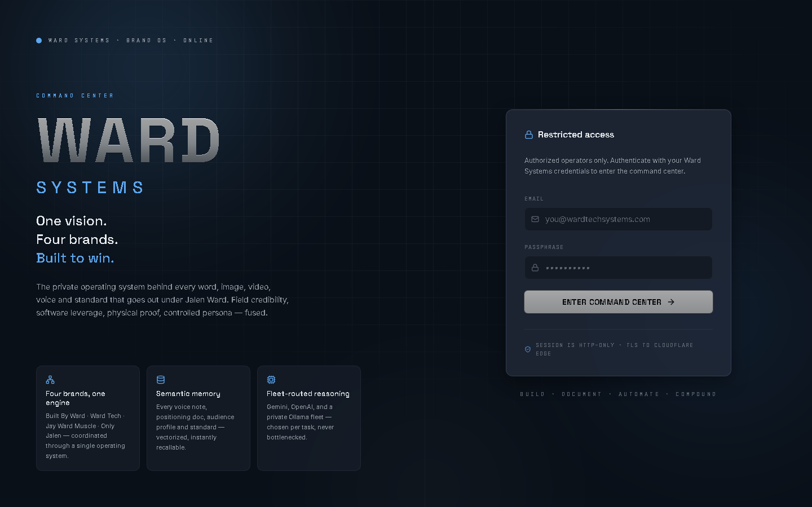
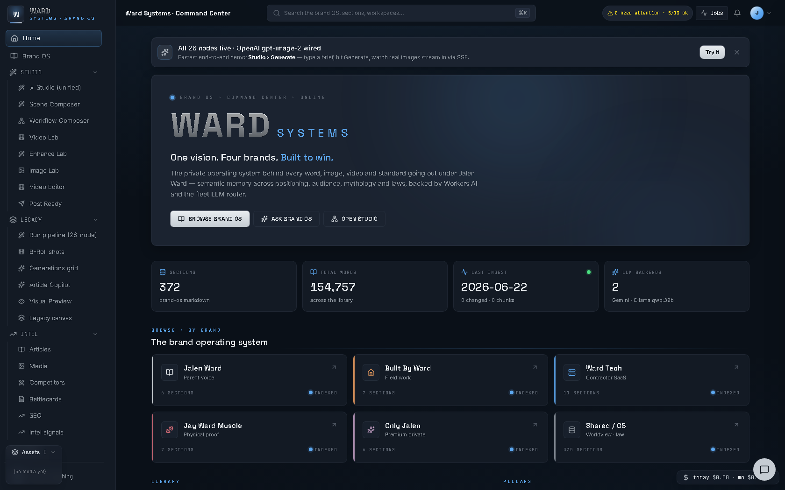
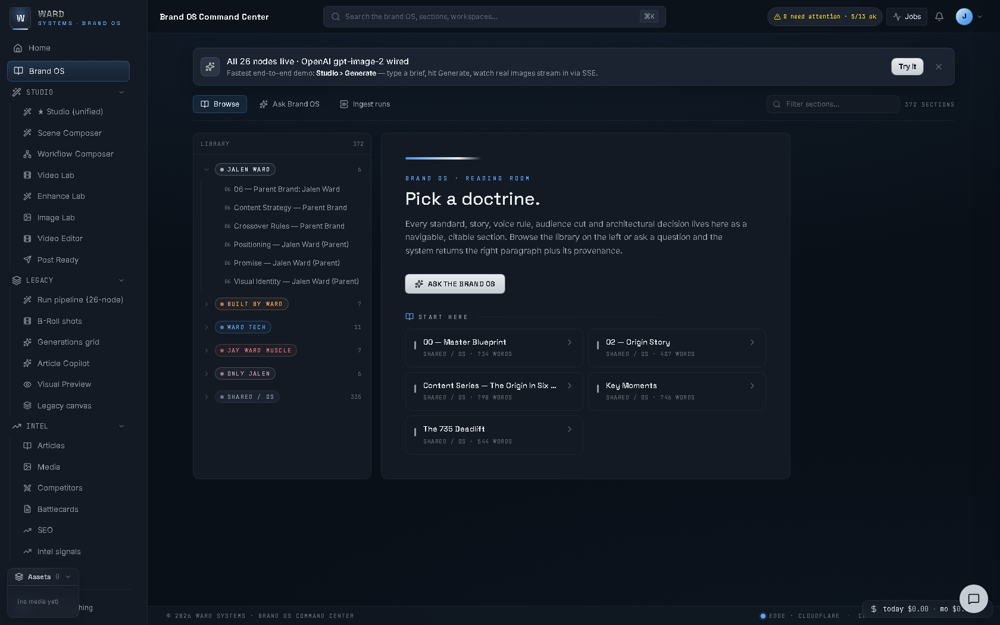
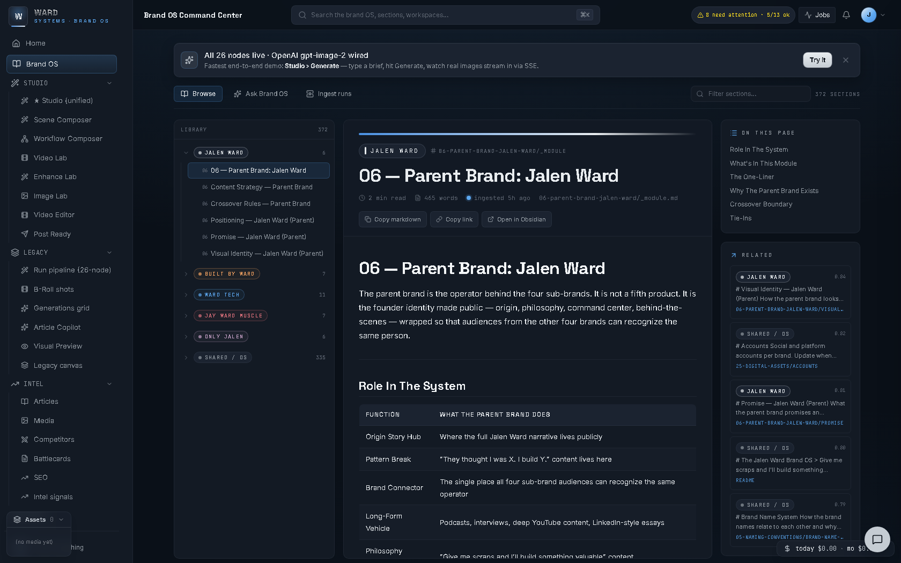
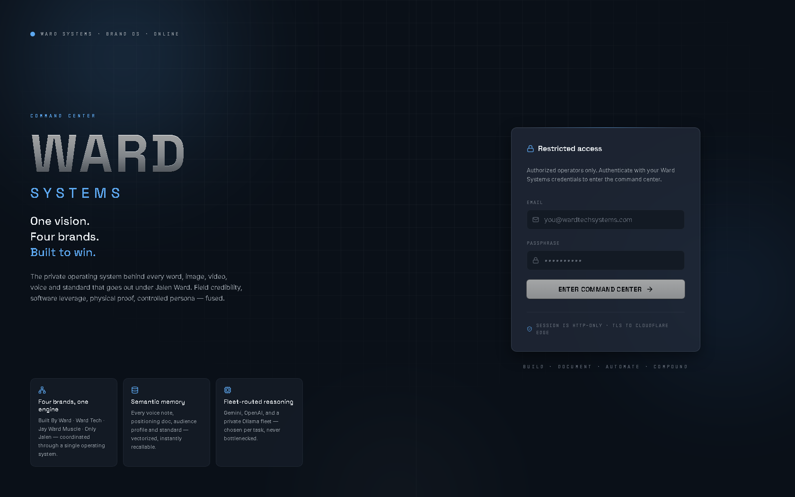
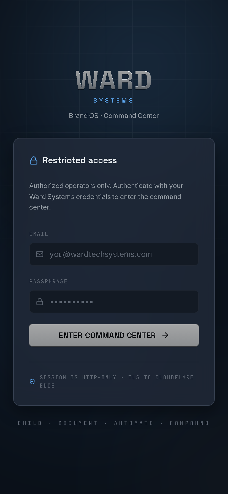
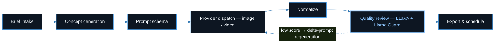
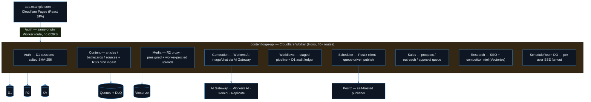
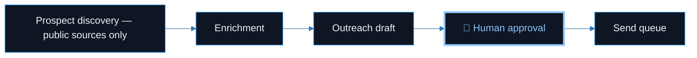

<a name="top"></a>

<div align="center">

# 🎛️ ContentForge

**A Cloudflare-native studio for planning, generating, reviewing, and scheduling social content — built as a single full-stack app on Workers, D1, R2, Queues, and Durable Objects.**

*Brief in, scheduled posts out — with an audit ledger on every pipeline step and a human gate on every outbound send.*

[](LICENSE)
[](#stack)
[](#stack)
[](#start)
[](#architecture)
[](#scope)

**[At a Glance](#glance)** · **[Features](#features)** · **[Pipeline](#pipeline)** · **[Architecture](#architecture)** · **[Getting Started](#start)** · **[Scope](#scope)** · **[FAQ](#faq)**

</div>

---

<a name="glance"></a>

## ⚡ At a Glance

| Question | Answer |
| :--- | :--- |
| **What problem does this solve?** | Getting from a creative brief to reviewed, scheduled social content usually means stitching together generators, review passes, a media library, and a scheduler. ContentForge runs that whole loop as one serverless app — without reinventing per-platform OAuth. |
| **What is implemented?** | The end-to-end brief → concept → prompt → generation → normalize → quality-review → export/schedule loop, a D1 audit ledger with input/output hashes per step, Workers AI safety review, an R2 media library, brand profiles, SEO/competitor research, a compliance-gated sales workflow, planning + Postiz publishing, multi-provider chat, and a live health board. |
| **What is *not* implemented?** | Multi-tenancy (this is a working single-tenant build), public hosting, and native per-platform OAuth (deliberately delegated to Postiz). The video editor and some Intel panels are prototype-grade — labeled honestly throughout. |
| **How do I reproduce it?** | `wrangler d1 migrations apply contentforge-prod --local && wrangler dev` + `npm run dev` in `web/` — no real keys needed to boot. |
| **What production lesson is baked in?** | Treat the publisher as a black box behind an API key: the app survives Postiz outages and can swap schedulers by changing a single consumer file. |

<details>
<summary><b>📑 Table of Contents</b></summary>
<br>

- [At a Glance](#glance)
- [Overview](#overview)
- [How it compares](#compare)
- [Features](#features)
- [Tech Stack](#stack)
- [Content Pipeline](#pipeline)
- [Architecture](#architecture)
  - [Worker & primitives](#architecture)
  - [The sales approval gate](#salesgate)
  - [Design decisions](#decisions)
- [Getting Started](#start)
- [Configuration](#config)
- [Scope & Status](#scope)
- [FAQ](#faq)
- [Glossary](#glossary)
- [Contributing](#contributing)
- [License](#license)

</details>

<a name="overview"></a>

## 🔎 Overview

ContentForge takes a creative brief and runs it through a multi-stage pipeline: brief intake → concept generation → prompt building → image/video generation → automated quality review → export and scheduling. Everything is stored in Cloudflare primitives so the app scales without servers to manage, and publishing is delegated to [Postiz](https://postiz.com) (a self-hostable social scheduler) so we don't reinvent per-platform OAuth.

The demo ships with a sample brand ("Acme", a field-sales/roofing marketing company) to give the studio realistic content to work with. Swap the brand profile, palette, and seed data to point it at anything else — see [`docs/REPLICATE-FOR-ANOTHER-COMPANY.md`](docs/REPLICATE-FOR-ANOTHER-COMPANY.md).

> [!NOTE]
> **Status:** working single-tenant build. The core generate → review → export → schedule loop runs end-to-end. Some surfaces (video editor, some Intel panels) are prototype-grade. Labeled honestly throughout.

<a name="compare"></a>

## ⚖️ How It Compares

| | **All-in-one social SaaS** | **ContentForge** |
| :--- | :--- | :--- |
| Hosting | Their servers, their tenancy | Your Cloudflare account, serverless primitives |
| Platform OAuth | Built and maintained in-house | Delegated to Postiz behind one API key |
| Pipeline auditability | Opaque | Every step in a D1 audit ledger with input/output hashes |
| Generated-content review | Varies | Captioned + safety-classified (LLaVA + Llama Guard) before surfacing |
| Outbound sales sends | Automated | **Human approval required** before anything sends |

## 🌐 Live Demo

_Not currently hosted publicly. Screenshots below; run locally with the steps under Getting Started._

## 📸 Screenshots

| Login | Command center dashboard |
| :--- | :--- |
|  |  |

| Brand profile — empty state | Brand profile — reading view |
| :--- | :--- |
|  |  |

<details>
<summary>More views (wide / mobile login)</summary>
<br>




</details>

<a name="features"></a>

## ✨ Features

- **Studio** — unified workspace to compose a brief, generate images/video, enhance, and mark posts ready. Live status streams into the generation grid over SSE.
- **Content pipeline** — a staged brief → concept → prompt-schema → provider-dispatch → normalize → quality-review → export flow. Each step is recorded in a D1 audit ledger with input/output hashes so any run is reproducible and inspectable.
- **Automated quality review** — generated assets are captioned and safety-classified via Workers AI (LLaVA + Llama Guard) before they're surfaced; low-scoring assets can trigger a delta-prompt regeneration.
- **Media library** — R2-backed, with drag-drop bulk upload (parallel, worker-proxied) and a reusable picker for reference images.
- **Brand profile** — voice, palette, products, and forbidden-claim rules that feed every LLM prompt. Cached in KV, embedded in Vectorize for similarity lookups.
- **Research & intel** — LLM-driven SEO keyword research (with a 24h KV cache) and competitor battlecards backed by Vectorize cosine similarity.
- **Sales workflow** — a compliance-gated prospect discovery → enrichment → outreach-draft → human-approval → send-queue sequence (public sources only; human approval required before anything sends).
- **Planning & scheduling** — a D1-backed weekly calendar and a publish queue that hands off to Postiz. A per-minute cron reconciles near-term scheduled posts.
- **Multi-provider LLM chat** — a context-aware chat slide-over reachable from any tab, routed through Cloudflare AI Gateway (OpenAI / Anthropic / Gemini).
- **System status** — a live health board that checks D1, R2, KV, Queues, AI Gateway, and Postiz connectivity.

<p align="right"><a href="#top">⬆ back to top</a></p>

<a name="stack"></a>

## 🧰 Tech Stack

| Layer | Choice |
| :--- | :--- |
| **Frontend** | React 19, Vite 6, Tailwind CSS v4, Motion, TypeScript |
| **Backend** | Cloudflare Workers (Hono router), TypeScript |
| **Data & infra** | D1 (SQLite), R2 (object storage), Queues (+ DLQ), Durable Objects (per-user SSE), KV (cache), Vectorize (embeddings), Cron triggers |
| **AI** | Cloudflare AI Gateway → Workers AI (`gpt-image`, chat, LLaVA, Llama Guard, BGE embeddings); Gemini and Replicate as optional providers |
| **Publishing** | Postiz public API (self-hosted) |
| **Video tooling** | A standalone Python script (`tools/generate_videos.py`) for image→video generation via Runway / Veo / OpenAI + FFmpeg |

<a name="pipeline"></a>

## 🔄 Content Pipeline



Each step is recorded in a **D1 audit ledger with input/output hashes**, so any run is reproducible and inspectable. Nothing reaches the studio surface without passing the review stage — and a low score doesn't just reject an asset, it can feed a delta prompt back into dispatch.

<a name="architecture"></a>

## 🏗️ Architecture



The Worker treats Postiz as a **black-box publisher behind an API key**, so it survives Postiz outages and can be swapped for another scheduler by changing a single consumer file. Everything else — auth, media, drafts, schedules, articles, workflows, audit ledger, brand profiles — lives in Cloudflare-native primitives.

Repo layout:

```text
web/       Vite + React SPA  (src/lib/api.ts is the single typed API client)
worker/    Cloudflare Worker (src/index.ts mounts every route; src/nodes/* are pipeline stages)
infra/     D1 migrations (0001–0007) + admin/content seeds
tools/     Python image→video generation script
docs/      Deploy runbook, architecture notes, rebrand guide
```

<a name="salesgate"></a>

### 🧑‍⚖️ The Sales Approval Gate

The sales workflow is compliance-gated by construction — public sources only, and nothing sends without a human:



<a name="decisions"></a>

### 🧠 Design Decisions

| Decision | Why |
| :--- | :--- |
| **Same-origin `/api/*` Worker route** | No CORS, no preflight tax, one origin to secure. |
| **Postiz as a black box** | Per-platform OAuth is someone else's full-time job; a single consumer file keeps the scheduler swappable and outage-tolerant. |
| **Audit ledger with input/output hashes** | Any pipeline run can be reproduced and inspected step by step — provenance for generated content. |
| **Safety review before surfacing** | LLaVA captions + Llama Guard classification gate every generated asset; low scores can regenerate via delta prompts instead of silently shipping. |
| **Durable Object per user for SSE** | Live generation status fans out per user without polling. |
| **KV for hot caches** | Brand profile and 24h SEO research caches keep repeat reads off the LLM path. |
| **Human approval on outbound sales** | Drafting is automated; sending is a human decision, always. |
| **Secrets via `wrangler secret put` only** | Keys never enter the repo; `wrangler.toml` carries placeholders, not credentials. |

<p align="right"><a href="#top">⬆ back to top</a></p>

<a name="start"></a>

## 🚀 Getting Started

Prerequisites: Node 20+, a Cloudflare account, and Wrangler (`npm i -g wrangler`).

```bash
# 1. Worker (API) — local D1 + wrangler dev
cd worker
npm install
cp .dev.vars.example .dev.vars        # fill in local dev values (no real keys needed to boot)
wrangler d1 migrations apply contentforge-prod --local
wrangler dev                          # http://localhost:8787

# 2. Web (SPA) — in another shell
cd web
npm install
npm run dev                           # http://localhost:5173, proxies /api/* to :8787
```

> [!IMPORTANT]
> Provider API keys are set as Worker secrets via `wrangler secret put` — **never committed**.

<details>
<summary><b>☁️ Pre-deploy checklist — Cloudflare resources</b></summary>
<br>

Before deploying you'll need to create the Cloudflare resources and fill the placeholder IDs in `worker/wrangler.toml`:

- [ ] Create the D1 database
- [ ] Create the R2 bucket
- [ ] Create the Queues (+ DLQ)
- [ ] Create the KV namespace
- [ ] Create the Vectorize index
- [ ] Create the AI Gateway
- [ ] Fill the `REPLACE_WITH_*` IDs in `worker/wrangler.toml`
- [ ] `wrangler secret put` each provider API key

The full production runbook is in [`docs/DEPLOY.md`](docs/DEPLOY.md).

</details>

<a name="config"></a>

## ⚙️ Configuration

- `worker/wrangler.toml` — all bindings, the cron, the route, and non-secret vars. The `database_id`, KV `id`, and `R2_ACCOUNT_ID` fields contain `REPLACE_WITH_*` placeholders — fill them with your own resource IDs.
- `worker/.dev.vars.example` and `tools/.env.example` — copy to the un-suffixed filenames and provide your own keys for local use.

<a name="scope"></a>

## 🎯 Scope & Status

Stated plainly:

- [x] Core generate → review → export → schedule loop — **runs end-to-end**
- [x] Audit ledger, safety review, media library, brand profiles, research, sales gate, planning, chat, health board — **implemented**
- [x] Video editor and some Intel panels — **prototype-grade, labeled as such in the UI**
- [ ] Multi-tenancy — **not implemented**; this is a working single-tenant build
- [ ] Public hosting — **not currently offered**; run it in your own Cloudflare account

<a name="faq"></a>

## ❓ FAQ

<details>
<summary><b>Can I point this at my own brand?</b></summary>
<br>

Yes — that's the intended path. Swap the brand profile, palette, and seed data; the walkthrough is in [`docs/REPLICATE-FOR-ANOTHER-COMPANY.md`](docs/REPLICATE-FOR-ANOTHER-COMPANY.md).

</details>

<details>
<summary><b>Does it post directly to Instagram / X / LinkedIn?</b></summary>
<br>

No — deliberately. Publishing hands off to a self-hosted Postiz instance via its public API, which owns the per-platform OAuth. ContentForge treats it as a swappable black box.

</details>

<details>
<summary><b>Can generated assets go out without review?</b></summary>
<br>

No. Every generated asset is captioned and safety-classified (LLaVA + Llama Guard) before it's surfaced, and low-scoring assets can trigger a delta-prompt regeneration instead.

</details>

<details>
<summary><b>Which AI providers does it use?</b></summary>
<br>

Everything routes through Cloudflare AI Gateway: Workers AI models (`gpt-image`, chat, LLaVA, Llama Guard, BGE embeddings) by default, with Gemini and Replicate as optional providers.

</details>

<details>
<summary><b>Is it multi-tenant?</b></summary>
<br>

Not yet — it's a working single-tenant build. The honest-labeling rule applies here too: what's prototype-grade says so.

</details>

<details>
<summary><b>What happens to outbound sales messages?</b></summary>
<br>

They stop at a human. Discovery and enrichment use public sources only, drafts queue for approval, and nothing enters the send queue without an explicit human decision.

</details>

<a name="glossary"></a>

<details>
<summary><b>📖 Glossary</b></summary>
<br>

| Term | Meaning |
| :--- | :--- |
| **D1 / R2 / KV** | Cloudflare's serverless SQLite database, object storage, and key-value cache. |
| **Queues + DLQ** | Cloudflare's message queues, with a dead-letter queue for failed deliveries. |
| **Durable Object (DO)** | A single-instance stateful Worker — here, one `ScheduleRoom` per user fanning out SSE. |
| **Vectorize** | Cloudflare's vector index — powers brand-profile similarity and competitor battlecards. |
| **SSE** | Server-sent events — the live status stream into the generation grid. |
| **AI Gateway** | Cloudflare's routing/observability layer in front of AI providers. |
| **Postiz** | A self-hostable social scheduler; ContentForge's delegated publisher. |
| **Delta prompt** | A corrective prompt derived from a failed review, fed back into regeneration. |

</details>

<a name="contributing"></a>

## 🤝 Contributing & Security

Issues and PRs are welcome — open an issue first for anything touching the pipeline stages or the publish path. Security concerns: report privately rather than via a public issue. Secrets never belong in `wrangler.toml` or the repo.

<a name="license"></a>

## 📄 License

MIT — see [LICENSE](LICENSE).

---

<div align="center">

<sub>If the pipeline-with-an-audit-trail approach is useful to you, a ⭐ helps others find it.</sub>

<br><br>

<sub><b>Built by Jalen Ward</b> · Ward Tech Systems · <a href="https://github.com/builtbyai">github.com/builtbyai</a></sub>

</div>
