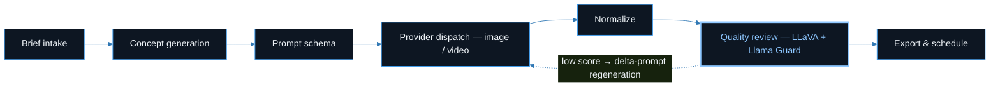
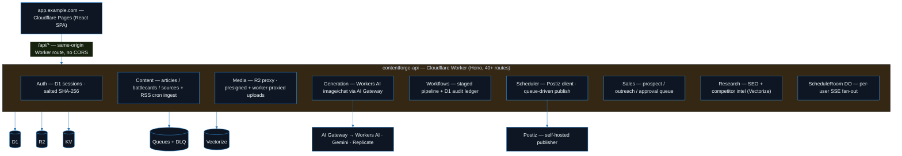

<div align="center">

# 🎛️ ContentForge

**A Cloudflare-native studio for planning, generating, reviewing, and scheduling social content — built as a single full-stack app on Workers, D1, R2, Queues, and Durable Objects.**

[](LICENSE)
[](#stack)
[](#stack)
[](#start)
[](#architecture)

**[Features](#features)** · **[Tech Stack](#stack)** · **[Pipeline](#pipeline)** · **[Architecture](#architecture)** · **[Getting Started](#start)** · **[Configuration](#config)**

</div>

---

ContentForge takes a creative brief and runs it through a multi-stage pipeline: brief intake → concept generation → prompt building → image/video generation → automated quality review → export and scheduling. Everything is stored in Cloudflare primitives so the app scales without servers to manage, and publishing is delegated to [Postiz](https://postiz.com) (a self-hostable social scheduler) so we don't reinvent per-platform OAuth.

The demo ships with a sample brand ("Acme", a field-sales/roofing marketing company) to give the studio realistic content to work with. Swap the brand profile, palette, and seed data to point it at anything else — see [`docs/REPLICATE-FOR-ANOTHER-COMPANY.md`](docs/REPLICATE-FOR-ANOTHER-COMPANY.md).

> [!NOTE]
> **Status:** working single-tenant build. The core generate → review → export → schedule loop runs end-to-end. Some surfaces (video editor, some Intel panels) are prototype-grade. Labeled honestly throughout.

## 🌐 Live Demo

_Not currently hosted publicly. Screenshots below; run locally with the steps under Getting Started._

## 📸 Screenshots

<a name="features"></a>

## ✨ Features

- **Studio** — unified workspace to compose a brief, generate images/video, enhance, and mark posts ready. Live status streams into the generation grid over SSE.
- **Content pipeline** — a staged brief → concept → prompt-schema → provider-dispatch → normalize → quality-review → export flow. Each step is recorded in a D1 audit ledger with input/output hashes so any run is reproducible and inspectable.
- **Automated quality review** — generated assets are captioned and safety-classified via Workers AI (LLaVA + Llama Guard) before they're surfaced; low-scoring assets can trigger a delta-prompt regeneration.
- **Media library** — R2-backed, with drag-drop bulk upload (parallel, worker-proxied) and a reusable picker for reference images.
- **Brand profile** — voice, palette, products, and forbidden-claim rules that feed every LLM prompt. Cached in KV, embedded in Vectorize for similarity lookups.
- **Research & intel** — LLM-driven SEO keyword research (with a 24h KV cache) and competitor battlecards backed by Vectorize cosine similarity.
- **Sales workflow** — a compliance-gated prospect discovery → enrichment → outreach-draft → human-approval → send-queue sequence (public sources only; human approval required before anything sends).
- **Planning & scheduling** — a D1-backed weekly calendar and a publish queue that hands off to Postiz. A per-minute cron reconciles near-term scheduled posts.
- **Multi-provider LLM chat** — a context-aware chat slide-over reachable from any tab, routed through Cloudflare AI Gateway (OpenAI / Anthropic / Gemini).
- **System status** — a live health board that checks D1, R2, KV, Queues, AI Gateway, and Postiz connectivity.

<a name="stack"></a>

## 🧰 Tech Stack

| Layer | Choice |
| :--- | :--- |
| **Frontend** | React 19, Vite 6, Tailwind CSS v4, Motion, TypeScript |
| **Backend** | Cloudflare Workers (Hono router), TypeScript |
| **Data & infra** | D1 (SQLite), R2 (object storage), Queues (+ DLQ), Durable Objects (per-user SSE), KV (cache), Vectorize (embeddings), Cron triggers |
| **AI** | Cloudflare AI Gateway → Workers AI (`gpt-image`, chat, LLaVA, Llama Guard, BGE embeddings); Gemini and Replicate as optional providers |
| **Publishing** | Postiz public API (self-hosted) |
| **Video tooling** | A standalone Python script (`tools/generate_videos.py`) for image→video generation via Runway / Veo / OpenAI + FFmpeg |

<a name="pipeline"></a>

## 🔄 Content Pipeline



Each step is recorded in a **D1 audit ledger with input/output hashes**, so any run is reproducible and inspectable.

<a name="architecture"></a>

## 🏗️ Architecture



The Worker treats Postiz as a **black-box publisher behind an API key**, so it survives Postiz outages and can be swapped for another scheduler by changing a single consumer file. Everything else — auth, media, drafts, schedules, articles, workflows, audit ledger, brand profiles — lives in Cloudflare-native primitives.

Repo layout:

```text
web/       Vite + React SPA  (src/lib/api.ts is the single typed API client)
worker/    Cloudflare Worker (src/index.ts mounts every route; src/nodes/* are pipeline stages)
infra/     D1 migrations (0001–0007) + admin/content seeds
tools/     Python image→video generation script
docs/      Deploy runbook, architecture notes, rebrand guide
```

<a name="start"></a>

## 🚀 Getting Started

Prerequisites: Node 20+, a Cloudflare account, and Wrangler (`npm i -g wrangler`).

```bash
# 1. Worker (API) — local D1 + wrangler dev
cd worker
npm install
cp .dev.vars.example .dev.vars        # fill in local dev values (no real keys needed to boot)
wrangler d1 migrations apply contentforge-prod --local
wrangler dev                          # http://localhost:8787

# 2. Web (SPA) — in another shell
cd web
npm install
npm run dev                           # http://localhost:5173, proxies /api/* to :8787
```

> [!IMPORTANT]
> Provider API keys are set as Worker secrets via `wrangler secret put` — **never committed**.

<details>
<summary><b>☁️ Pre-deploy checklist — Cloudflare resources</b></summary>
<br>

Before deploying you'll need to create the Cloudflare resources and fill the placeholder IDs in `worker/wrangler.toml`:

- [ ] Create the D1 database
- [ ] Create the R2 bucket
- [ ] Create the Queues (+ DLQ)
- [ ] Create the KV namespace
- [ ] Create the Vectorize index
- [ ] Create the AI Gateway
- [ ] Fill the `REPLACE_WITH_*` IDs in `worker/wrangler.toml`
- [ ] `wrangler secret put` each provider API key

The full production runbook is in [`docs/DEPLOY.md`](docs/DEPLOY.md).

</details>

<a name="config"></a>

## ⚙️ Configuration

- `worker/wrangler.toml` — all bindings, the cron, the route, and non-secret vars. The `database_id`, KV `id`, and `R2_ACCOUNT_ID` fields contain `REPLACE_WITH_*` placeholders — fill them with your own resource IDs.
- `worker/.dev.vars.example` and `tools/.env.example` — copy to the un-suffixed filenames and provide your own keys for local use.

## 📄 License

MIT — see [LICENSE](LICENSE).
